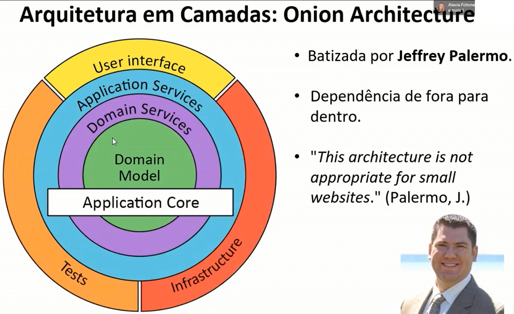

# Introdução ao Domain Driven Design e Padrões de Arquitetura

## Reflitamos sobre arquitetura de software

- Uma arquitetura define ESTRUTURA.
- Uma arquitetura define COMPORTAMENTO.
- Uma arquitetura balanceia NECESSIDADES DOS STAKEHOLDERS.
- Uma arquitetura define é influenciada pelo AMBIENTE.
- Uma arquitetura define influencia a estrutura do TIME.
- Uma arquitetura define pode seguir um ESTILO ARQUITETURAL.
- Decisões na arquitetura influenciam em custo, manutenibilidade, performance, escalabilidade etc.

## Reflitamos sobre design de software

- Inclui todas as atividades que auxiliam na transformação da necessidade de negócio em software funcnionando.
- Os principais artefatos do processo de design de software incluem:
  - Especificação de Requisitos;
  - Design de Alto Nivel;
  - Design Detalhado.

## Arquitetura vs Design

## Estilos Arquiteturais

- Camadas;
- Microserviços;
- Pipes e Filters;
- Plugins
- Client/Server
- Etc.

## Padrões Arquiteturais

- MVC;
- CQRS;
- Event Sourcing;
- 3 camadas;
- Onion;
- Clean;
- Hexagonal;
- Etc.

## DDD - Domain Driven Design

- DDD não é sobre arquitetura, é sobre design, é sobre como você aborda o negócio para criação do software!
- Indicado para aplicações complexas com muitas entidades e regras de negócio.
- "simples" de entender, muito difícil de aplicar.
- DDD é sobre negócio:
  - Agrupar conhecimento de negócio.
  - Reconhecer e separar subdomínios.
  - Desenhar modelo de domínio rico.

- DDD pode ser usado com qualquer estilo ou padrão arquitetural:
  - CQRS;
  - Estrutura em camadas;
  - Etc.
- DDD é uma abordagem de design (modelagem) de software, não é tecnologia e poderia ser chamado de "filosofia".

### Maintaining Model Integrity

### Domain

## Precisamos de tudo isso?

> **INDO ALÉM...**
>
> https://www.lambda3.com.br/2012/03/arquitetura-emergente/
>
> https://www.lambda3.com.br/2017/12/lambda3-podcast-74-arquitetura-emergente/

