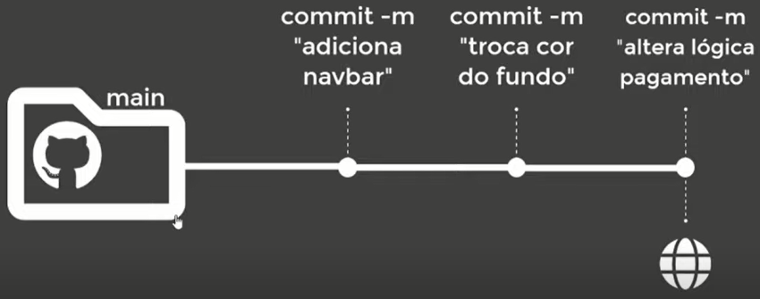
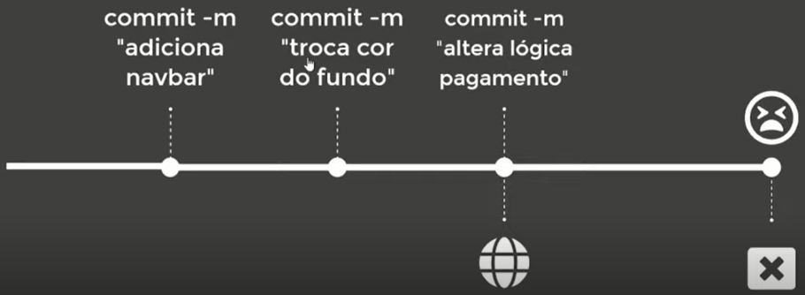
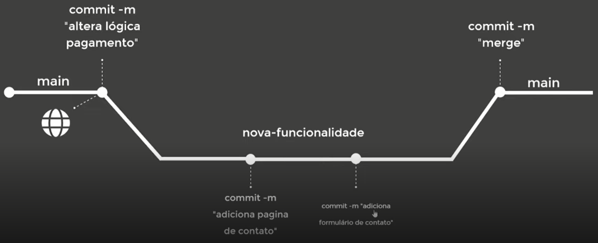
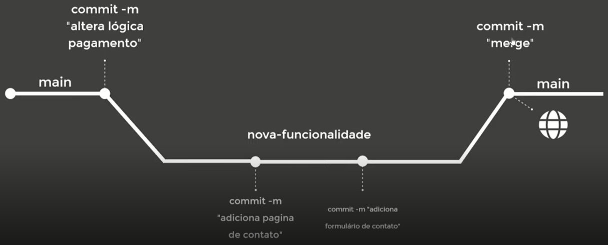
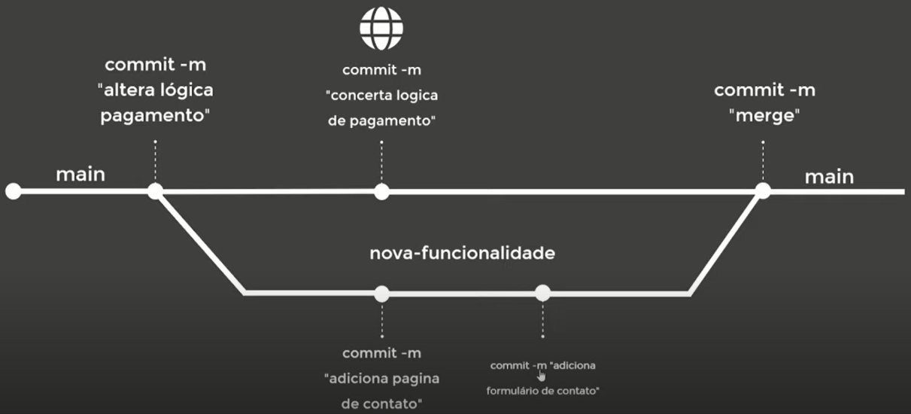

# Trabalhando com Branches no GitHub


## Primeiros conceitos sobre branches

> É sempre interessante que o nome da branch seja o mais descritível possível. Por exemplo, se estivermos trabalhando alguma funcionalidade, que o nome dessa branch seja o mesmo que a funcionalidade em questão.


### Introdução às branches












### Entendendo na prática sobre branches

#### Main vs Master

> Por muitos anos a branch padrão, na instalação do Git foi a master. Por outro lado, a branch padrão no GitHub é a main.

Quando se instala o **Git** em nossa máquina, atualmente, é perguntado qual será o **nome da branch principal**, se **master**, ou outro nome qualquer.

Em paralelo, quando se cria um novo repositório no **GitHub**, não existe nenhuma branch atrelada a ele, uma vez que não houve um commit. Todavia, se no momento da criação do repositório, adicionarmos a criação do **README.md** e/ou do **gitingnore**, será feito um primeiro commit e com isso, a nomeação da **branch principal** como **main**.


#### Guiando-se nas branches com a tag HEAD

> Ferramenta **visualizing git**: https://git-school.github.io/visualizing-git/


**Git HEAD**: A HEAD no git representa a versão que você está trabalhando no momento. Normalmente quando fazemos checkout de uma branch normal, o git automaticamente coloca o ponteiro da HEAD no local certo com a ultima versão daquela branch. E com isso podemos continuar trabalhando sem problemas


```js
$ git checkout -b <nome da nova brach>
```


#### Navegação em branches


#### Criar, Editar e Deletar (localmente)


## Visualizaçao de histórico


## Entenda como reverter commits


## Estruturando commits


