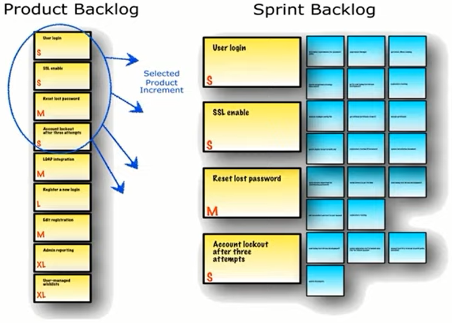

# Fundamentos de um Projeto Ágil

## Papéis e responsabilidades - Product Owner

O **Product Owner (PO)** representa o profissional que tem a visão do que serão desenvolvidas, as necessidades a serem atendidas, o público que vai utilizar os serviços e os objetivos a serem alcançados. De Forma geral:

- Ele visualiza o valor que vai ser agregadado para Empresa e para o cliente que vai usar o produto construído.

- Ele também define a ordem que as atividades serão desenvolvidas. Ele também é responsável por validar ser esses itens, que estão sendo entregues nas Sprints, estão agregando o valor esperado. Caso não esteja, ele tem que planejar os ajustes necessários nas próximas Sprints, a fim de manter o objetivo inicial proposto.

- Na pior das hipóteses o PO também é responsável por cancelar uma Sprint. 
- Quando as atividades planejadas não poderem mais ser entregues, ou ele entender que o valor esperado não vai ser mais atingido. Nesse caso, cabe ao PO replanejar a Sprint, mantendo os dias para a conclusão da mesma, com alguma entrega de valor possível.

- Se nenhuma entrega executável for possível, o PO pode priorizar uma estudo afim de otimizar o desenvolvimento de uma próxima Sprint. Esse estudo é conhecido como **spike**.

> Um spike é um método de desenvolvimento de produto originado da programação extrema que usa o programa mais simples possível para explorar soluções potenciais. É usado para determinar quanto trabalho será necessário para resolver ou contornar um problema de software. Normalmente, um "teste spike" envolve a coleta de informações adicionais ou testes para casos extremos facilmente reproduzíveis. O termo é usado em abordagens de desenvolvimento ágil de software como Scrum ou programação extrema.
>
> Um spike em um sprint pode ser usado de várias maneiras:
>
> - Como forma de familiarizar a equipe com um novo hardware ou software
> - Para analisar um problema minuciosamente e auxiliar na divisão adequada do trabalho entre membros separados da equipe.
> - Os testes spike também podem ser usados para mitigar riscos futuros e podem descobrir problemas adicionais que não foram notados.
>
> Uma distinção pode ser feita entre spikes técnicos e spikes funcionais. 
>
> - O spike técnico é usado com mais frequência para avaliar o impacto que uma nova tecnologia tem sobre a implementação atual. 
> - Um spike funcional é usado para determinar a interação com um novo recurso ou implementação. 
>
> Para acompanhar esses itens de trabalho, em um sistema de tíquetes, uma nova história de usuário pode ser configurada para cada spike, para fins de organização. 
>
> Após um spike, os resultados (um novo design, um fluxo de trabalho refinado, etc.) são compartilhados e discutidos com a equipe.

Quantas aos papéis e responsabilidades de um PO, podemos dizer que:

- Ele é um representante da área de Negócios;
- PO não é um Comitê;
- Ele define as funcionalidades do software (Product Backlog);
- Ele prioriza as funcionalidades de acordo com o valor do negócio;
- Ele garante que o time de desenvolvimento entenda os itens do Backlog no nível necessário.

> Obs: Não há divisão de hierarquia entre o PO, o SM e o Time DEV, para não ocorrer conflito de interesses.

O principal papel do PO é trazer o máximo de valor possível para o produto. Assim. Ele deve garantir que pôr esforço empregado no desenvolvimento daquele produto traga o maior retorno possível, seja ele: 

- Financeiro;

- O fato de ele facilitar o máximo a execução de alguma atividade;

- Permitir que o cliente concluísse o processo crítico de maneira mais simples possível.

### Algumas ideias acerca do PO

O PO deve sempre, antes de qualquer coisa, entender qual o objetivo daquele produto, o que ele quer alcançar, quem vai utilizar, como vai utilizar em qual circunstância aquele produto será utilizado. E só após entender tudo isso, o PO deve validar se o produto faz sentido ou não.

Dentro da Sprint, o PO tem participação obrigatória nas cerimônias de Planning e de Review.

O participação do PO nas Daily Meeting não deve ser obrigatória, porém, o PO deve se fazer presente tempo suficiente para que todas as dúvidas de negócio do time DEV sejam sanadas, para não causar nenhum atraso no desenvolvimento devido a falta de informação. 

O PO nunca deve julgar qualquer dúvida: TODA DÚVIDA É VÁLIDA. Se houve alguma dúvida é porque não estava claro na história reescrita pelo PO.

O PO deve sempre trazer, das dúvidas do time DEV, um aprendizado para melhorar cada vez mais as suas histórias. 

O PO não deve aguardar até a Review para validar as entregas. Na verdade, é importante que o PO acompanhe o desenvolvimento e participe das Daily Meeting sempre que possível, mesmo não sendo obrigatório. Pois é importante que o PO ter a visão se a Sprint está de pé ou fadada ao fracasso, para antever as suas ações e até priorizar o Backlog de maneira mais assertiva. Afinal é fundamental o PO entender qual o desempenho do time DEV a cada Sprint. E assim ir aumentando a sinergia e melhorando a qualidade das entregas a cada ciclo.

### Refining e Plannig

## Analisando escopo e definindo prioridades

## Papel do PO na transformação digital

