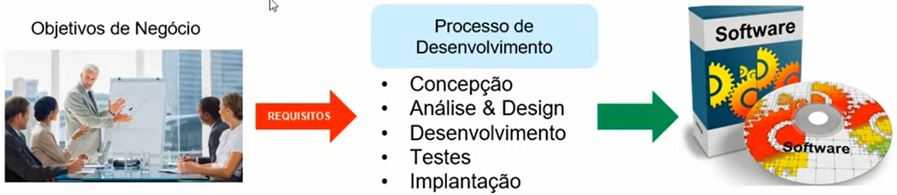
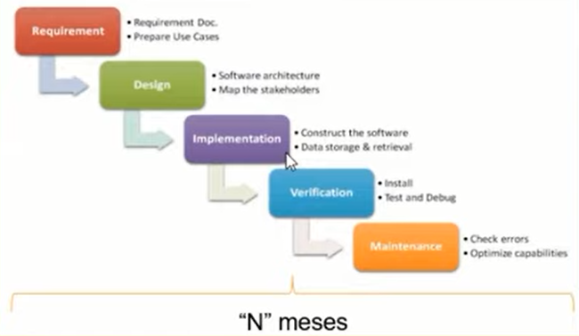
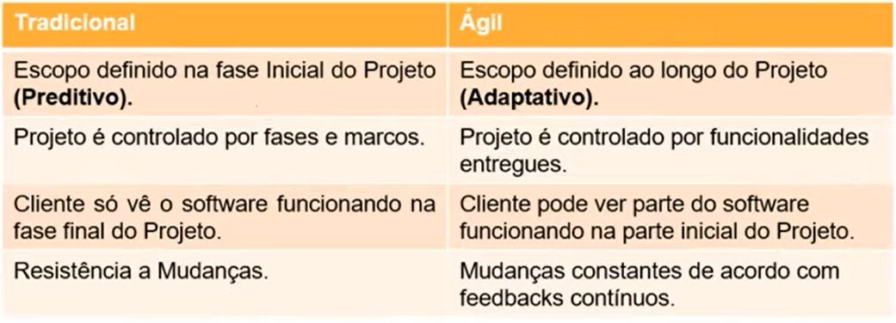
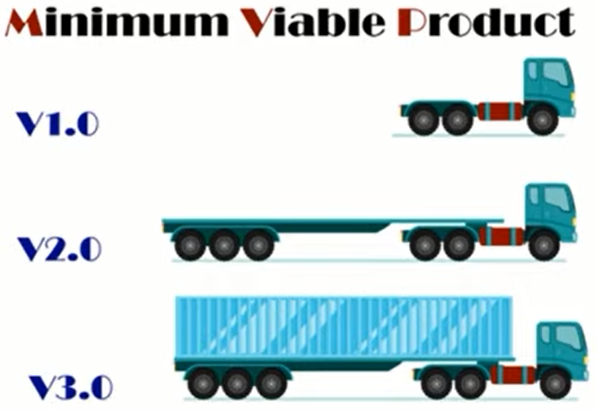
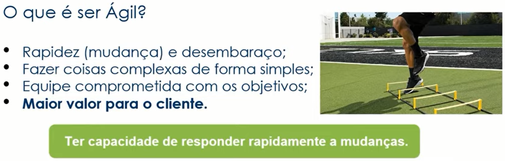
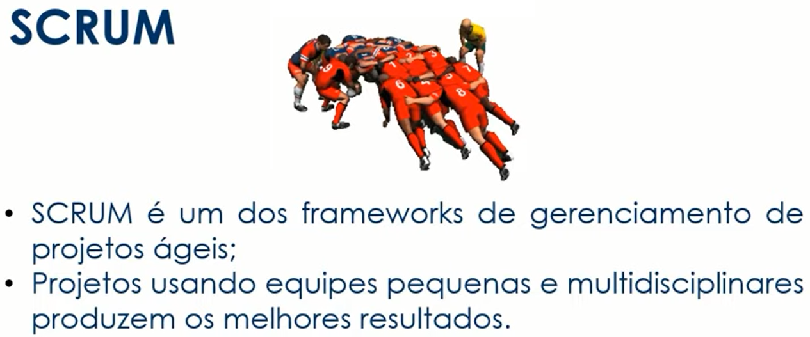
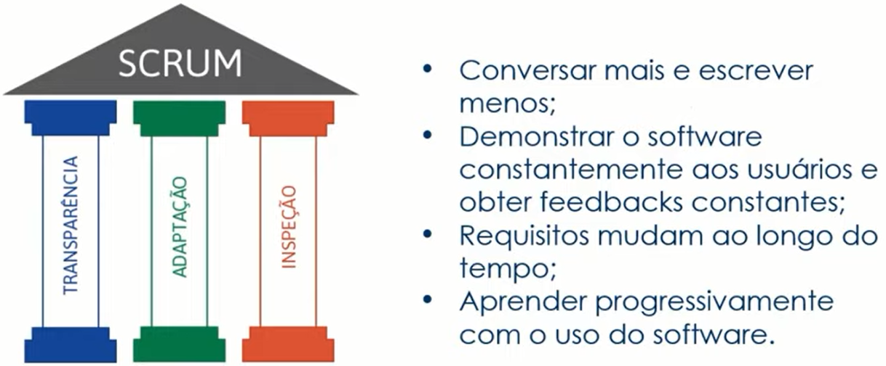
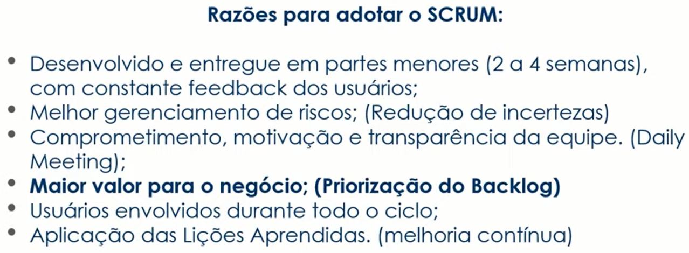
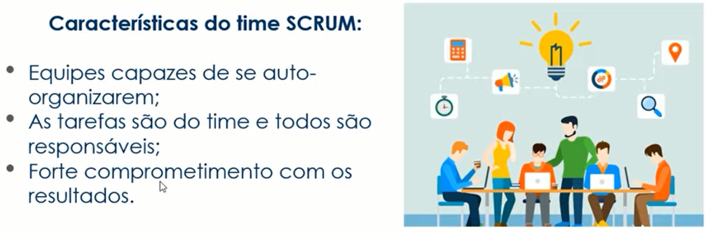
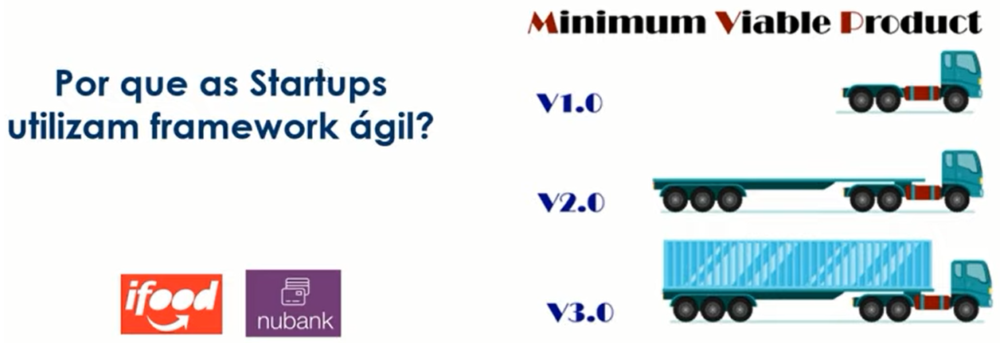

# Gestão de projetos ágeis com SCRUM
_Noções gerais_

### Método tradicional

  

  

### Comparação entre os dois métodos

  

  

  

### O que é ser ágil?

  

### SRUM

  

  

#### Razões para adotar o SRUM

  

#### Características do SRUM

  

#### Curiosidade

  

