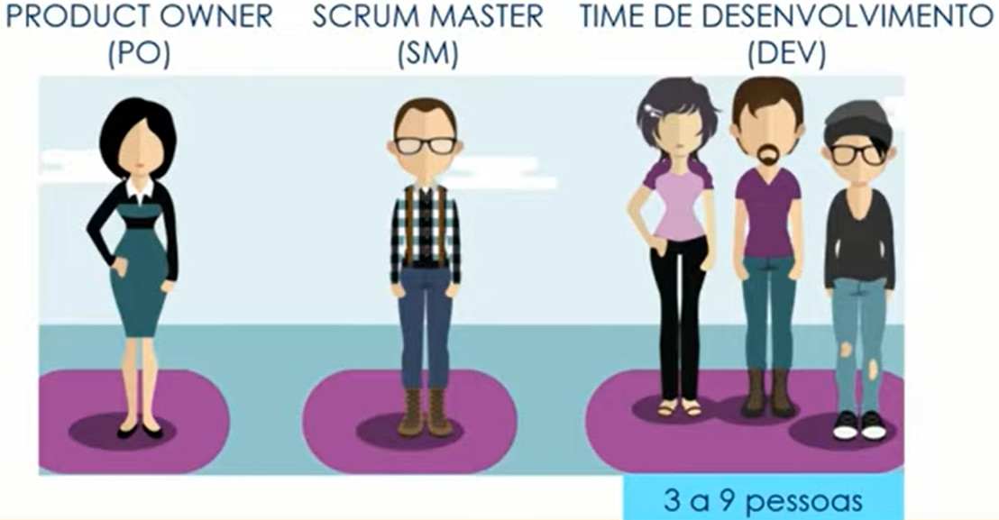
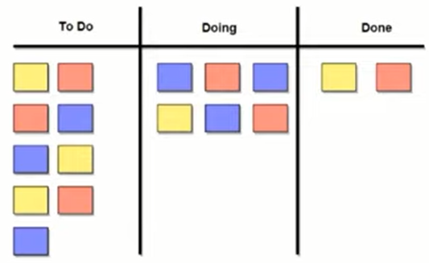

# Gestão de projetos ágeis com SCRUM

_Noções gerais_

## Método tradicional
O Princípio de Pareto também se aplica ao desenvolvimento de software, onde 20% das funcionalidades costumam gerar 80% ou mais do benefício esperado.

> O princípio de Pareto afirma que, para muitos eventos, aproximadamente 80% dos efeitos vêm de 20% das causas.

## Comparação entre os dois métodos
**Tradicional ou Waterfall:** Só permite que o projeto avance quando uma fase está inteiramente completa.

**Ágil:** Software contruído por partes (incremental) e cada parte executa-se em um ciclo (interativo).

<table style="float:right">
    <tr>    
        <th>Tradicional</th>    
    	<th>Ágil</th>
    </tr>  
    <tr>
        <td>Escopo definido na fase inicial do Projeto (Preditivo).</td>
        <td>Escopo definido ao longo do Projeto (Adaptativo).</td>
    </tr>
    <tr>
        <td>Projeto é controlado por fases e marcos.</td>
        <td>Projeto é controlado por funcionalidades entregues.</td>
    </tr>
    <tr>
        <td>Cliente só vê o software funcionando na fase final do Projeto.</td>
        <td>Cliente pode ver parte do software funcionando na parte inicial do Projeto.</td>
    </tr>
    <tr>
        <td>Resistência a mudanças.</td>
        <td>Mudanças constantes de acordo com feedback contínuos.</td>
    </tr>
</table>

Em projetos tradicionais (Waterfall), você corre o risco de descobrir que estava errado depois de meses. Com o SCRUM, você descobre que estava errado em no máximo 30 dias.

## O que é ser ágil?

- Rapidez (mudança) e desembaraço;

- Fazer coisas complexas de forma simples;

- Equipe comprometida com os objetivos;

- Maior valor para o cliente

  

> Ter capacidade de responder rapidamente a mudanças.

## SRUM

- SCRUM é um dos frameworks de gerenciamento de projetos ágeis;
- Projetos usando equipes pequenas e multidisciplinares produzem os melhores resultados.

- Conversar mais e escrever menos;
- Demonstrar o software constantemente aos usuários e obter feedbacks constantes;
- Requisitos mudam ao longo do tempo;
- Aprender progressivamente com o uso do software.

### Razões para adotar o SRUM

- Desenvolvido e entregue em partes menores (2 a 4 semanas), com constante feedback dos usuários;
- Melhor gerenciamento de riscos (Redução de incertezas);
- Comprometimento, motivação e transparência da equipe (Daily Meeting);
- Usuários envolvidos durante todo o ciclo;
- Aplicação das Lições Aprendidas (Melhoria contínua).

### Características do SRUM

- Equipes capazes de se auto-organizarem;
- As tarefas são do time e todos são responsáveis;
- Forte comprometimento com os resoltados.

### Curiosidade

Por que as Startups utilizam framework ágil?

# Papéis e Responsabilidades de cada um do time

## Papéis e Responbilidades

**Product Owner (PO)**

- Representante da área de Negócios;
- PO não é um Comitê;
- Define as funcionalidades do software (Product Backlog);
- Prioriza as funcionalidades de acordo com o valor do negócio;
- Garante que o time de desenvolvimento entenda os itens do Backlog no nível necessário.

**Scrum Master (SM)**

- Garantir o uso correto de SCRUM;
- Scrum Master não é Gerente de Projetos;
- Age como facilitador;
- Auxilia o Product Owner no planejamento e estimativas do backlogs;
- Auxilia a equipe a remover impedimentos;
- Treina o time em autogerenciamento e interdisciplinaridade.

**Time de Desenvolvimento (DEV)**

- Possui habilidades suficientes para desenvolver, testar, criar e desenhar, ou seja, tudo que for necessário para entregar o software funcionando.

# Cerimônias do SCRUM

> **Time Box:** *Tempo máximo para fazer um Cerimônia ou Sprint*

> **Sprint (corrida ou arrancada):** *É o principal evento do SCRUM. Um Sprint tem duração de, mais ou menos, 30 dias corridos.*

### Composição de uma Sprint

- Planejamento da Sprint;

- Reuniões Diárias (Daily Meeting) [ Time Box de 15 minutos];

- Revisão da Sprint (Review);

- Retrospectiva da Sprint.

  

### Planejamento da Sprint

_Feito no primeiro dia da Sprint_

> Dura cerca de 8 horas, para uma Sprint de 30 dias. 

#### Nas 4 primeiras tem o objetivo "do que fazer".

Quem participa?

- PO;
- SM;
- DEV.

O quê fazer?

- O PO vai explicar para o time quais são as funcionalidades que o time precisa entrega e os porquês, naquela Sprint.
- O time DEV vai tirar todas as dúvidas sobre o que fazer em relação ao negócio, durante essas 4 primeiras horas, para entender o que o PO deseja.

Como fazer?

- O time DEV quebrar as atividades e entender tecnicamente como tudo deve ser feito.

> Planning Poker: também chamado de Scrum poker, é uma técnica gamificada e baseada em consenso para estimar, usada principalmente para timeboxing nos princípios Agile.

- O time DEV faz um estimativa de todas as tarefas, a serem realizadas naquela Sprint.
- O time DEV vai, em seguida, verificar se tudo o que o PO queria, poderá ser entregue naquela Sprint.
- O time DEV devolve para o PO o que ele realmente vai conseguir entregar naquela Sprint.

### Reuniões Diárias (Daily Meeting)

Participam o PO, SM e time DEV.

O time DEV vai responder a três questões:

- O que ele fez no dia anterior;
- O que ele fará no dia;
- E se tem algum impedimento.

> A reunião é feita de pé e dura 15 minutos. Ela ocorre no mesmo local e horário estipulado pelo grupo. Ela é tambem conhecida com Standup Meeting.

O quadro kanban permite a vizualização do andamento das tarefas realizadas.

### Revisão da Sprint (Review)

O time DEV apresenta para o PO o trabalho feito.

> Realizada no último dia da Sprint ocorre uma revisão com duração de 4 horas, para uma Sprint de 30 dias.

### Retrospectiva da Sprint

Reunião da equipe DEV precisa ser transparente para apontar as Lições Aprendidas.

> Relizada, também, no último dia da Sprint. Tem duração de 3 horas, para uma Sprint de 30 dias

