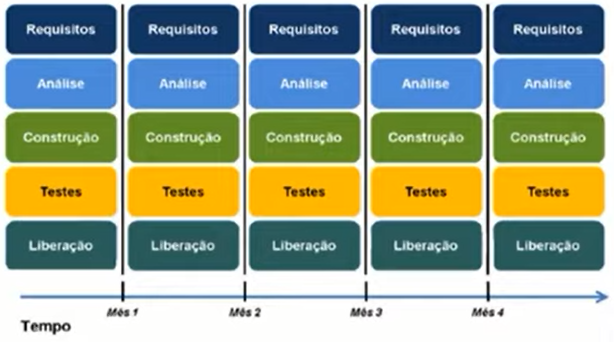

# Gestão de projetos ágeis com SCRUM
_Noções gerais_

### Método tradicional

  

O Princípio de Pareto também se aplica ao desenvolvimento de software, onde 20% das funcionalidades costumam gerar 80% ou mais do benefício esperado.

> O princípio de Pareto afirma que, para muitos eventos, aproximadamente 80% dos efeitos vêm de 20% das causas.

  

### Comparação entre os dois métodos

  

  

  

### O que é ser ágil?

  

### SRUM

  

  

#### Razões para adotar o SRUM

  

#### Características do SRUM

  

#### Curiosidade

  

