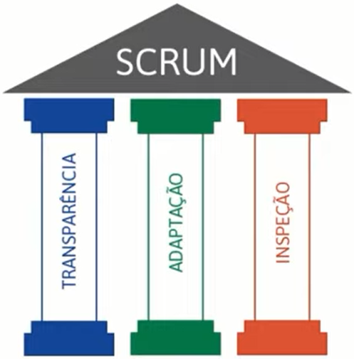

# Gestão de projetos ágeis com SCRUM

_Noções gerais_

## Método tradicional
O Princípio de Pareto também se aplica ao desenvolvimento de software, onde 20% das funcionalidades costumam gerar 80% ou mais do benefício esperado.

> O princípio de Pareto afirma que, para muitos eventos, aproximadamente 80% dos efeitos vêm de 20% das causas.

## Comparação entre os dois métodos
**Tradicional ou Waterfall:** Só permite que o projeto avance quando uma fase está inteiramente completa.

**Ágil:** Software contruído por partes (incremental) e cada parte executa-se em um ciclo (interativo).

<table style="float:right">
    <tr>    
        <th>Tradicional</th>    
    	<th>Ágil</th>
    </tr>  
    <tr>
        <td>Escopo definido na fase inicial do Projeto (Preditivo).</td>
        <td>Escopo definido ao longo do Projeto (Adaptativo).</td>
    </tr>
    <tr>
        <td>Projeto é controlado por fases e marcos.</td>
        <td>Projeto é controlado por funcionalidades entregues.</td>
    </tr>
    <tr>
        <td>Cliente só vê o software funcionando na fase final do Projeto.</td>
        <td>Cliente pode ver parte do software funcionando na parte inicial do Projeto.</td>
    </tr>
    <tr>
        <td>Resistência a mudanças.</td>
        <td>Mudanças constantes de acordo com feedback contínuos.</td>
    </tr>
</table>

Em projetos tradicionais (Waterfall), você corre o risco de descobrir que estava errado depois de meses. Com o SCRUM, você descobre que estava errado em no máximo 30 dias.

## O que é ser ágil?

- Rapidez (mudança) e desembaraço;

- Fazer coisas complexas de forma simples;

- Equipe comprometida com os objetivos;

- Maior valor para o cliente

  

> Ter capacidade de responder rapidamente a mudanças.

## SRUM

- SCRUM é um dos frameworks de gerenciamento de projetos ágeis;
- Projetos usando equipes pequenas e multidisciplinares produzem os melhores resultados.

- Conversar mais e escrever menos;
- Demonstrar o software constantemente aos usuários e obter feedbacks constantes;
- Requisitos mudam ao longo do tempo;
- Aprender progressivamente com o uso do software.

### Razões para adotar o SRUM

- Desenvolvido e entregue em partes menores (2 a 4 semanas), com constante feedback dos usuários;
- Melhor gerenciamento de riscos (Redução de incertezas);
- Comprometimento, motivação e transparência da equipe (Daily Meeting);
- Usuários envolvidos durante todo o ciclo;
- Aplicação das Lições Aprendidas (Melhoria contínua).

### Características do SRUM

- Equipes capazes de se auto-organizarem;
- As tarefas são do time e todos são responsáveis;
- Forte comprometimento com os resoltados.

### Curiosidade

Por que as Startups utilizam framework ágil?

